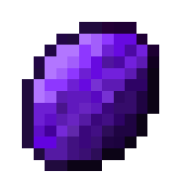

  

###

**🛑 Проект только начал разрабатываться и всё что написано дальше - лишь задумка которая находится в процессе реализации**

---

### Skaz: RPG Adventure for Minecraft ( VERY ALPHA )

**Skaz** добавляет уникальные материалы, руду, инструменты, магические механики, создавая совершенно новый опыт RPG в Minecraft.

---

## 🎲 Основные механики
- **Прокачка уровня**: Базовая механика жанра RPG.
- **Универсальные классы**: Выберите определенный класс и совмещайте его с другими с помощью предметов!
- **Различные вариации оружия**: Создавайте посохи наносящие физический урон или мечи бьющие огнем вокруг с помощью специальных материалов!
- **И многое другое!**

---

## 🌟 Основные материалы
- **Ксентарит**: Лёгкий и прочный материал для создания тёмного оружия.
- **Флорит**: Материал для насыщения оружий магией земли.
- **Океанит**: Материал для насыщения оружий магией воды.
- **Вулканит**: Легендарный ресурс для создания уникального оружия либо насыщения магией огня.
- **Лунный кристалл**: Используется для создания мощных посохов.

---

## 📥 Установка
1. Убедитесь, что у вас установлен Minecraft Forge.
2. Скачайте последнюю версию **Skaz** из [Releases](https://github.com/ovelwe/skaz/releases).
3. Переместите `.jar` файл мода в папку `mods` вашего Minecraft.
4. Запустите игру на версии 1.20 и наслаждайтесь!

---

## 📸 Скриншоты
Скоро...

---

## 📜 Планы на будущее
- Реализовать все вышеописанное
- Ввести крафты для ритуалов и зачарования.
- Добавить боссов, мобов для раскачки и строения(данжи)

---

## 📧 Контакты
Если у вас есть идеи или вы нашли баги либо хотите помочь, пишите в [Issues](https://github.com/ovelwe/skaz/issues) или свяжитесь со мной:
- **Discord**: abcd000

---

## 💖 Благодарности
- **Minecraft Community** за вдохновение.
- **Forge Team** за их работу над моддингом Minecraft и шедевральной документацией.
